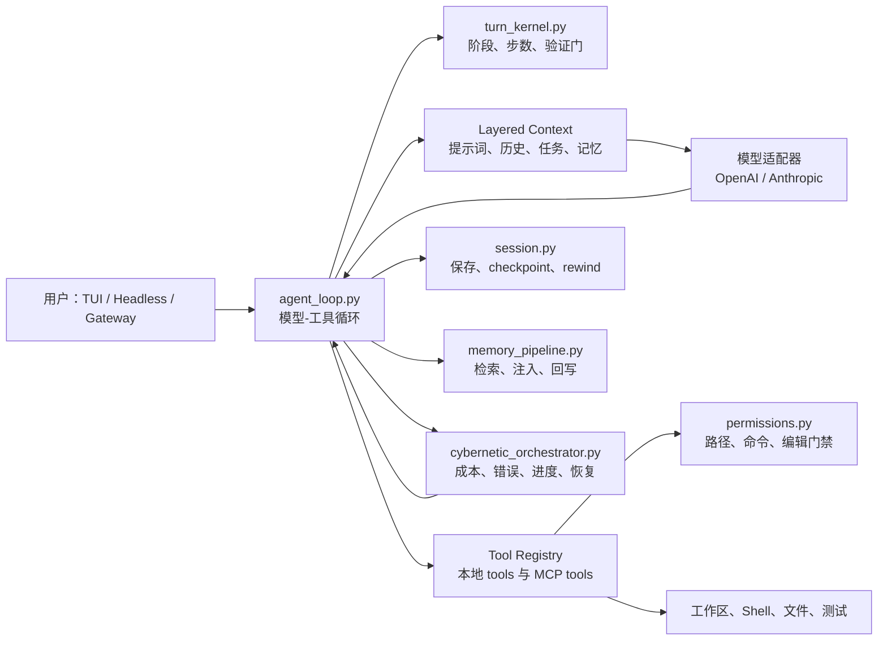

# MiniCode 项目全景学习手册

> 面向长期学习与技术面试。本文以仓库根目录的 Python 包 `minicode/` 为事实依据；`ts-src/` 是平行的 TypeScript 实现。文中会明确区分 **当前代码已经实现** 与 **建议的优化方向**，避免把设想说成事实。

## 1. 先用一句话记住它

MiniCode 是一个运行在本地终端里的 Coding Agent：用户交给它一个开发任务，它调用大模型决定下一步，再调用读文件、改文件、执行命令、搜索等工具完成工作；同时，它把“能否恢复、是否安全、有没有验证过、上下文是否失控”作为运行时问题显式管理。

它不只是一个“聊天框 + 大模型 API”。其核心主张是：**让 Agent 的执行过程可观察、可恢复、可验证。**

可以把它想象为一个刚入职的开发同事：

- 大模型是“大脑”，负责理解任务、规划和决定调用什么工具；
- 工具是“手脚”，负责读写文件、执行命令、运行测试；
- `agent_loop.py` 是“工作流程负责人”，不断让大脑和手脚轮流工作；
- `turn_kernel.py` 是“流程规则”，规定先探索、再执行、最后验证，避免一直乱试；
- memory 是“笔记本”，在上下文不足或跨会话时找回有用事实；
- session/checkpoint/rewind 是“工作日志 + 撤销点”；
- permissions 是“门禁”；
- cybernetic orchestrator 是“运行监控员”，根据错误、进度、成本、上下文压力决定压缩、恢复、调模型等动作。

## 2. 项目边界与目录地图

当前 Python 主包由 [`pyproject.toml`](../pyproject.toml) 的命令入口确定：

| 入口 | 作用 | 主要去向 |
| --- | --- | --- |
| `minicode-py` | 交互式终端 Agent | `minicode.main:main` |
| `minicode-headless` | 单次无界面执行 | `minicode.headless:main` |
| `minicode-gateway` | 简单 HTTP 网关 | `minicode.gateway:run_gateway` |
| `minicode-cron` | 定时任务入口 | `minicode.cron_runner:main` |

最重要的目录：

| 路径 | 你应该怎样理解它 |
| --- | --- |
| `minicode/` | Python 运行时的主实现，面试应以此为主讲对象 |
| `minicode/tools/` | Agent 可调用的本地能力，如读写文件、执行命令、Git、测试 |
| `minicode/tui/` | 终端界面的渲染、输入、事件和状态 |
| `tests/` | 对核心路径、失败恢复、压力和产品入口的可执行约束 |
| `docs/` | 产品定位、设计、优化与验证材料 |
| `ts-src/` | 平行 TypeScript 版本；可以说“架构理念相近”，但不要混淆为 Python 的运行时依赖 |
| `.mini-code-memory/` | 运行时生成的项目记忆，不是源代码能力本身 |

### 2.1 关键术语

| 词 | 通俗解释 | 在 MiniCode 中的落点 |
| --- | --- | --- |
| Agent | 能自己选择工具并连续执行多步的程序 | `agent_loop.py` |
| Turn | 用户一次请求对应的一轮执行周期 | `run_agent_turn()` |
| Tool call | 模型输出结构化请求，让程序执行一个工具 | `ToolRegistry` 与 `tools/` |
| Context | 发送给模型的系统提示、历史、任务和工具结果 | `layered_context.py`、`context_manager.py` |
| Verification | 不是听模型说完成，而是运行检查拿证据 | `verification_controller.py`、`turn_kernel.py` |
| Session | 可落盘、可恢复的一段工作历史 | `session.py` |
| Checkpoint | 对修改前/修改中关键文件状态的快照 | `FileCheckpoint` |
| Rewind | 按 checkpoint 恢复本地文件 | `rewind_session()` |
| MCP | 让外部工具服务按统一协议接入 Agent 的标准 | `mcp.py` |

## 3. 总体架构：先建立一张脑内地图



注意：上图是职责图，不表示所有模块每一步都会被调用。比如 MCP 客户端只有配置了外部 server 后才参与；verification 也会根据任务风险决定是否执行。

## 4. 一次请求如何真正跑完

假设用户说：“给这个 Python 项目增加一个配置校验，并运行相关测试。”

1. **入口接收任务。** TUI、headless 或 gateway 将用户文本组装成消息，交给 `run_agent_turn()`。
2. **建立稳定任务描述。** `agent_loop.py` 会从消息中抽取任务，并与 `TaskObject`、任务图、稳定任务包结合。目的不是“多做一层包装”，而是避免多轮工具调用后忘记最初目标。
3. **组装上下文。** 系统提示、历史消息、工作区信息、工具定义，以及适合的记忆被拼接成模型输入。`LayeredContext` 的思想是把不同来源的信息分层，而不是散乱拼字符串。
4. **模型给出下一步。** 模型可能先请求 `list_files`、`read_file` 或 `grep_files`，而不是直接修改。此时属于 explore 阶段。
5. **工具请求经过门禁。** 读写范围、命令、编辑操作由 `PermissionManager` / `PermissionGate` 检查；需要时提示用户确认或使用已保存的许可。
6. **执行工具并写回结果。** 工具结果变成新的上下文；`TurnRecurrentState` 记录是否有工具结果、错误次数、进度摘要等状态。
7. **持续决策。** `turn_kernel.py` 根据步数、工具结果、是否有进展、是否需要证据，决定继续执行、要求验证、允许 widening、等待用户，还是停止。
8. **验证而非自我宣布。** 对编辑类任务，`VerificationController` 会按改动风险和文件类型推导检查强度与候选命令；只有有证据才适合报完成。
9. **持久化与可恢复。** session 保存 transcript、元数据、checkpoint、runtime 摘要等。若改错了，可以先 `rewind-preview`，再按 checkpoint 恢复。
10. **运行时调节。** orchestrator 汇集上下文压力、错误、进度、成本、provider 情况等信号，触发压缩、记忆注入/反思、模型路由或自愈相关动作。

**面试表达重点：** 不要把它说成固定工作流。它是“模型决定下一步工具 + 内核施加边界”的闭环：模型负责灵活性，运行时负责可控性。

## 5. 核心一：Agent Loop——整个系统的发动机

`minicode/agent_loop.py` 很大，因为它是系统集成点。核心函数是 `run_agent_turn()`。它要协调：模型调用、工具执行、历史消息、错误处理、session 事件、memory、权限、模型切换与产品层事件。

### 5.1 为什么一定是 Model → Tool → Model 循环

语言模型本身不能可靠地读取你的磁盘，也不知道命令是否真的执行成功。因此需要闭环：

```text
模型：我需要读 config.py
程序：执行 read_file(config.py)，返回内容
模型：发现已有 Config 类，我修改其中的校验
程序：执行 patch/edit，返回 diff 与结果
模型：运行 pytest
程序：返回测试输出
模型：基于证据总结完成情况
```

如果没有第二次“Tool → Model”，模型就只能猜执行结果；如果没有状态与步数约束，模型又可能无限循环。所以 Agent Loop 不能只是 `while True`。

### 5.2 工具执行的工程细节

`_execute_single_tool()` 是典型边界：它接收工具调用，执行注册表中的工具，记录工具生命周期事件，并把异常转成模型能理解的结果。这样模型看到的不是 Python traceback，而是“这个工具失败了，原因是什么，是否应该换一个策略”。

当前实现还包含模型 API 失败摘要、可恢复 thinking stop、空响应重试和 provider fallback 的判断函数。这说明它关注的不只是“正常成功路径”。

### 5.3 它的优点与不足

**优点：** 集成点统一，运行时事件能够贯通；从 tool result 到 session/verification 的关系明确。

**不足：** 该文件约 100KB，承担过多编排职责。长期维护中，任何新增能力都可能让主循环继续膨胀。

**可优化：** 以明确接口拆分 `TurnExecutor`（模型与工具循环）、`RuntimeEventPublisher`（事件）、`RecoveryCoordinator`（失败恢复）、`SessionCoordinator`（持久化）。拆分不是为了“文件小”，而是减少控制流耦合，并让每个失败路径可单测。

## 6. 核心二：Turn Kernel——把自由 Agent 变成受控执行

`minicode/turn_kernel.py` 定义一系列状态对象：`TurnBudgetSignals`、`TurnVerificationState`、`TurnStepPolicy`、`TurnRecurrentState`、`AssistantTurnDecision` 和 `ToolTurnDecision`。

它解决的核心矛盾是：模型需要自由探索，但生产系统不能无限花钱、无限试错，也不能没有证据就说完成。

### 6.1 三阶段模型

| 阶段 | Agent 应做什么 | 常见工具 | 不应做什么 |
| --- | --- | --- | --- |
| `explore` | 理解目录、约束、现状，缩小问题 | list、grep、read | 未确认现状就大面积改文件 |
| `execute` | 实施有依据的最小改动 | edit、patch、run command | 长时间重复探索、不推进目标 |
| `verify` | 拿可复现证据，核对任务是否完成 | test runner、lint、检查 diff | 仅根据自然语言自称完成 |

`derive_turn_step_policy()` 根据循环状态推导当前策略；`decide_assistant_turn()` 与 `decide_tool_turn()` 将模型输出和工具结果转成结构化决策。这样阶段规则不是散落在 Prompt 中的几句文字，而是代码层的约束。

### 6.2 widening 是什么

正常预算不足时，系统不应悄悄无限增加步骤。widening 是有条件地扩大执行空间：只有任务有进展、原预算确实不足，或出现需要更深探索的证据时才激活，并记录原因和证据摘要。

这比“设置很大的 max_steps”好，因为它把成本和风险变成可解释的运行时事件。

### 6.3 验证门

`TurnVerificationState` 会追踪是否严格、是否要求显式最终答复、是否要求证据、证据是否就绪。`build_verification_evidence_nudge()` 在证据不足时不是直接放行，而是提醒 Agent 补齐验证。

**要诚实的边界：** 这能降低“模型空口报完成”，但不能保证所有测试都正确、更不能证明业务需求一定满足。验证质量取决于推导出的命令、测试覆盖和任务语义。

## 7. 核心三：工具、权限与本地安全

`minicode/tooling.py` 定义工具抽象，`minicode/tools/` 提供具体实现。模型通过工具名称、描述和 JSON Schema 知道可用能力与参数形状；程序执行前仍需要自己校验。

### 7.1 为什么模型输出 JSON 也不可信

模型可能生成缺字段、类型错误、越界路径，甚至在被恶意文本诱导后请求危险命令。因此“模型会按 schema 调用”只是体验层约束；真正的边界在工具的 `validator` 和权限层。

### 7.2 PermissionManager 做了什么

`permissions.py` 提供：

- 路径规范化，并通过 `_is_within_directory()` 判断是否在授权目录内；
- 读、写、编辑三类访问控制；
- 命令签名格式化与危险命令分类；
- 当前 turn 的临时授权与可持久化的授权存储；
- `PermissionGate` 作为给工具调用的更窄接口。

编辑时可以展示 diff preview，再决定是否执行；这把“不可逆副作用”前置给用户。

### 7.3 当前安全边界的局限

危险命令分类天然不完整：同一效果可通过 shell 拼接、脚本解释器、别名、间接下载等方式实现。仅靠命令黑名单无法对抗所有绕过。

**更强的路线：**

1. 在受限容器或低权限子进程中运行命令；
2. 拆分“只读、工作区写、网络、进程管理”能力令牌；
3. 对命令做 shell AST/语义解析，而非字符串匹配；
4. 对文件访问解析真实路径，防止 symlink 绕过；
5. 审计所有授权决定并提供一键撤销。

## 8. 核心四：Session、Checkpoint、Rewind

`session.py` 的 `SessionData` 不只是聊天记录容器。它持有 workspace、元数据、transcript、历史、运行时摘要、checkpoint 等，使工作可以 inspect、replay、resume。

### 8.1 为什么 Session 比对话历史更重要

真正的开发任务会修改文件、跑命令、发生错误、切换模型。只保存消息会丢掉“为什么现在是这个状态”。因此 session 要记录：

- 用户和模型消息、工具调用与工具结果；
- 当前任务和阶段相关摘要；
- checkpoint 的文件快照与内容哈希；
- 指令层、hook、extension、readiness 等产品面状态摘要；
- 保存时间、workspace 与恢复所需元数据。

### 8.2 增量保存与合并

`save_session()` 支持 full save 与 delta；`_save_delta()`、`_consolidate_deltas()` 的目的，是避免每一次轻微状态变化都重写完整大 JSON。`AutosaveManager` 则根据脏状态和时间间隔决定何时落盘。

这是典型取舍：增量更省 I/O，但恢复逻辑更复杂，必须处理损坏、顺序、重复应用和版本兼容。

### 8.3 checkpoint 与 Git 的差别

Git commit 是开发者明确创建的版本历史，适合多人协作、分支、合并与长期审计。Agent checkpoint 是运行时保护点，适合“模型刚刚要改文件，我先留个可自动恢复的快照”。两者不互斥。

`rewind-preview` 的价值在于：先显示将恢复哪些文件、恢复到哪个状态，防止用户把“撤销最近一步”误理解成“回到很久以前”。

## 9. 核心五：记忆与上下文管理

大模型的上下文窗口有限，且一次会话结束后不会自然记住项目事实。MiniCode 因而区分工作记忆、持久记忆及其处理管线。

`MemoryPipeline` 包含五段闭环：

| 方法 | 意义 |
| --- | --- |
| `read()` | 针对当前任务检索候选记忆 |
| `inject()` | 将筛选后的内容以受控方式注入上下文 |
| `write()` | 把有价值的新事实写入记忆系统 |
| `feedback()` | 根据使用效果调整记忆评价或统计 |
| `maintain()` | 在合适时机做维护、冷却或清理 |

它还包含查询改写、检索失败后的 reformulation、spread activation 和自适应 cooldown。直观理解：系统不希望每一轮都把所有“相关记忆”塞回模型，否则既浪费 token，又会让陈旧信息污染判断。

### 9.1 记忆不是万能 RAG

检索到的内容可能过期、错误或只在旧分支成立。因此记忆应该被视为“待核验线索”，而不是最高优先级事实。对代码任务，应优先信任当前工作区可读到的文件；记忆帮助定位和解释，不替代读取真实代码。

### 9.2 可优化方向

- 使用关键词/路径过滤 + 向量检索 + reranker 的混合检索；
- 为每条记忆记录来源文件、commit、更新时间、置信度和失效条件；
- 根据任务类型设置注入预算，例如 debugging 比代码生成更需要历史错误信息；
- 在模型采纳记忆后要求做 source verification；
- 对敏感记忆分级，避免跨项目、跨用户泄漏。

## 10. 核心六：MCP——把外部能力接进来

`mcp.py` 的核心客户端是 `StdioMcpClient`。它以 JSON-RPC 请求外部 MCP Server，并支持换行 JSON 与 `Content-Length` 帧两种常见传输格式。可发现的对象不只工具，还有 resources 和 prompts。

`create_mcp_backed_tools()` 会把 server 暴露的 tool descriptor 转换成 MiniCode 的 `ToolDefinition`，并使用形如 `mcp__服务器名__工具名` 的包装名称，减少命名冲突。模型看到的仍是统一工具表；真正调用时，包装函数转发给 `tools/call`。

### 10.1 懒启动的取舍

MCP Server 不必在 Agent 启动时全部拉起：未使用的 server 不消耗启动时间和资源，坏掉的 server 不阻塞其他功能。代价是首次调用会有冷启动延迟，失败会更晚暴露。

代码中通过请求超时、pending queue、stdout 线程、payload 大小限制和子进程退出时通知未完成请求来控制风险。

**重要边界：** MCP 是扩展协议，不是权限协议。外部 server 能做什么，仍必须接受 MiniCode 的本地权限策略和更强的沙箱约束。

## 11. 核心七：模型适配、路由与故障恢复

模型适配器负责把统一的聊天/工具调用需求转成 provider API。`model_switcher.py` 的 `ModelSwitcher` 则维护当前模型、切换历史、失败记录、候选 fallback 和跨 provider 限制。

为什么不能“请求失败就换任何模型”？因为不同 provider 对工具调用、上下文格式、模型能力、鉴权和限流语义不同。盲切换会把一个 429 或 API Key 错误变成多次无意义失败，也可能让原本能工作的工具协议失效。

更合理的策略是：

1. 先分类失败：瞬时网络、限流、认证、模型不可用、请求格式错误；
2. 对同模型可恢复错误做有限退避重试；
3. 仅在候选模型满足能力要求且没有连续失败时 fallback；
4. 记录 switch reason、原模型、目标模型与结果；
5. 对用户展示“本地逻辑失败”还是“provider 不可用”。

## 12. 核心八：Cybernetic Orchestrator——为什么叫控制论

`CyberneticOrchestrator` 不替代 Agent Loop，它是一个运行时协调层。其 `step_start()` / `step_end()` 接收每一步的状态，连接 memory、healing、模型路由与成本控制。

“控制论”在这里不是营销词，至少应满足：**观测信号 → 形成判断 → 执行动作 → 再观测结果**。

| 信号 | 可能动作 |
| --- | --- |
| 上下文压力升高 | compact、减少注入、保护关键任务摘要 |
| 工具/模型错误增加 | 记录失败、触发自愈或模型切换建议 |
| 长时间没有进展 | 调整策略、widen 或停止并请求用户输入 |
| token/调用数过高 | 成本控制、降低路径深度 |
| 当前任务需要历史事实 | 注入检索到的记忆 |

**成熟度评价：** 这是一套可扩展的 facade 与信号管线。它是否真的“自适应有效”，仍需要线上指标和对照实验验证，不能只因存在很多 controller 文件就声称已经实现自主优化。

## 13. 验证、测试与产品入口

`VerificationController` 将改动文件、风险分数和任务信息转成 `VerificationPlan`：风险等级、模式、建议命令与目标测试。对 Python 文件，它会尝试推断相应测试目标；高风险任务应使用更严格策略。

项目的 `tests/` 覆盖 Agent loop、MCP、session、memory、权限、cybernetics、TUI、集成与压力场景。这比只测试几个工具函数更接近 Agent 的真实风险：很多 bug 来自模块组合、异常和状态恢复。

产品入口层面：

- TUI 面向持续交互与可视化 transcript；
- Headless 面向脚本或单次任务；
- Gateway 提供 HTTP 形式入口；
- Cron 面向定时运行。

原则是入口尽量薄，核心 runtime 复用，避免“命令行能恢复、HTTP 却不能”这种功能分叉。

## 14. 设计亮点：面试时最值得讲的六件事

1. **运行时优先。** 不只做模型调用，把阶段、预算、停止原因、验证证据变成显式状态。
2. **恢复优先。** session、checkpoint、preview、rewind 让本地副作用可回看、可撤销。
3. **验证优先。** 用测试/命令输出替代模型自我评价，降低“假完成”。
4. **本地安全意识。** 路径、命令、编辑分层授权，而不是让模型直接拥有 shell。
5. **记忆闭环。** 检索、注入、回写、反馈、维护，而非“接一个向量库就结束”。
6. **扩展边界。** MCP 与统一工具抽象使外部能力能接入，而不污染 Agent 主循环。

## 15. 真实缺陷与应对口径

| 缺陷/风险 | 不要回避的说法 | 下一步怎么做 |
| --- | --- | --- |
| 主循环较大 | “集成效率高，但编排职责偏集中” | 抽取协调器与事件接口，保持行为测试不变 |
| 安全不能只靠命令分类 | “黑名单是基础防线，不是强隔离” | 沙箱、最小能力令牌、真实路径解析 |
| 模型与工具输出不确定 | “测试能覆盖协议和恢复，不能保证所有模型行为” | 固定 mock 回归集 + provider smoke + 任务成功率指标 |
| 记忆可能陈旧 | “记忆是线索，不是事实源” | 增加来源、时效、重排与引用核验 |
| 自适应控制效果难证明 | “架构已具备信号闭环，效果需要实验数据” | A/B、消融、成本/成功率/恢复率指标 |
| MCP 首次调用脆弱 | “懒启动优化启动体验，但要治理冷启动失败” | 健康检查、预热选项、熔断、错误可视化 |

## 16. 建议的学习顺序

1. 先阅读 `README.md` 与本文第 1—4 节，知道项目要解决什么；
2. 阅读 `agent_loop.py` 中 `run_agent_turn()`，画出关键调用；
3. 阅读 `turn_kernel.py` 的状态对象、`derive_turn_step_policy()` 和两个 decision 函数；
4. 阅读一个本地工具与 `permissions.py`，理解副作用控制；
5. 阅读 `session.py` 的 `SessionData`、保存和 rewind；
6. 阅读 `memory_pipeline.py`，再回看 context manager；
7. 阅读 `mcp.py`，自己启动一个 fake MCP server 做实验；
8. 最后读 orchestrator 与 tests，建立“系统如何在失败时工作”的视角。

## 17. 90 秒项目介绍模板

> MiniCode 是一个本地优先的终端 Coding Agent。它的主链路是模型决定下一步、工具执行、再把结果反馈给模型的循环；但项目的重点不只是把工具调起来，而是给这个循环加上运行时控制。比如我们用 turn kernel 区分探索、执行和验证阶段，限制无效循环，并要求完成类任务提供测试或命令证据；用 session、checkpoint 和 rewind 管理本地文件副作用；用 permissions 控制路径、命令和编辑；用 memory pipeline 在长任务和跨会话场景下检索并注入项目知识；外部工具则通过 MCP 接入。当前我会把它定位为可用的本地 Agent runtime 原型，强项是可恢复、可观测和可验证；下一步重点是把主循环进一步解耦、提升沙箱安全，并用真实任务指标验证自适应策略的收益。

## 18. 自测：你是否真正掌握了它

如果能不用看文档回答下面问题，说明已经形成完整心智模型：

1. 为什么 `agent_loop` 不能独自承担所有控制逻辑？
2. 为什么“模型输出了完成”不等于任务完成？
3. checkpoint 和 Git 各自适合什么场景？
4. MCP 发现工具后，模型究竟看到了什么？
5. 记忆为何不能替代读取当前代码？
6. 哪些失败可以靠 retry，哪些应当切模型或让用户介入？
7. 当前最重要的两个工程风险是什么，为什么？

能把每题回答成“机制 + 取舍 + 证据 + 优化”，而不是只背术语，就已经可以把这个项目讲成自己的项目。
